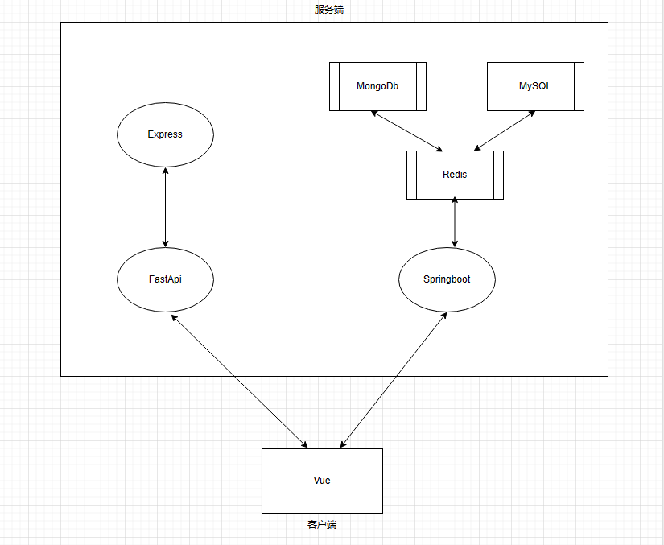
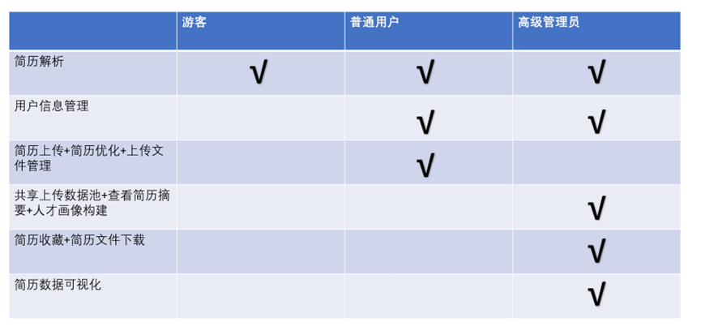
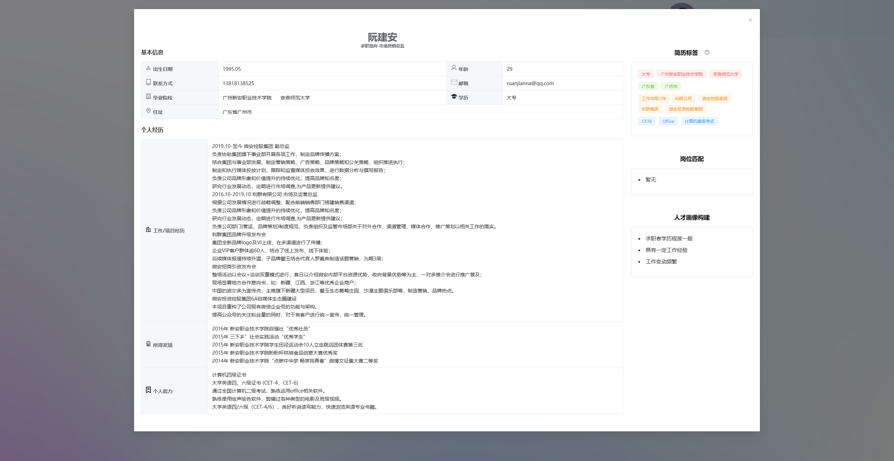
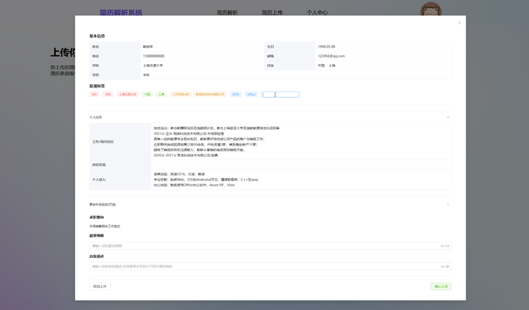
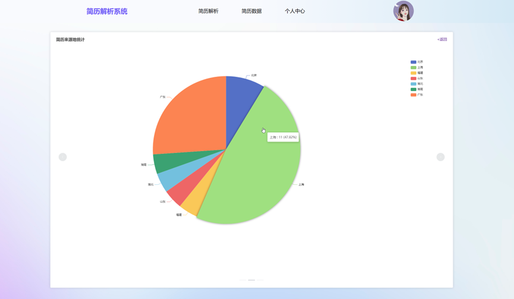
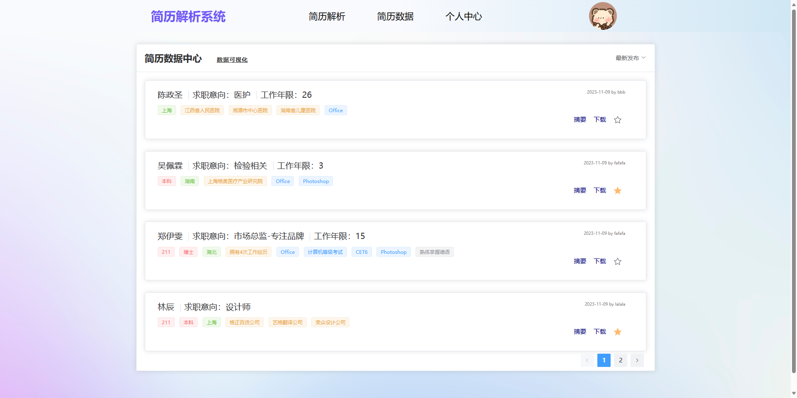

# 简历解析系统

基于自然语言处理技术的前后端分离项目，支持对多种格式的简历文件进行关键信息的提取，分析和数据可视化

> 有问题看 issues
>
> 维护计划目前在重构 vue 部分（感觉升级到 vite 和 typescript 迁移成本属实有点大...）
>
> :point_right: feat/fe-refactor

### 目录说明

```
├─Assets	相关图片
├─Express	后端，用于word转文本
├─FastApi	 后端，用于封装模型
├─Frontend	前端
├─SpringBoot	后端，用于用户和简历数据管理
├─Sql	数据库建表
├─Train	模型训练
│  └─classfication	分类器
│  └─ner	命名实体识别
│  └─test	模型测试
├─Utils	工具
│  └─format	格式转换
│  └─gather	分类数据采集
```

### 项目运行

#### 前端

```shell
pnpm install

pnpm dev
```

#### 后端

##### FastAPI

-   推荐通过`docker`进行部署（建议使用 x86+ubuntu20.04 配置，其他配置暂未做运行测试）

```shell
docker pull mariannaaa/resume_fastapi:1.2

docker run -itd -p 8000:8000 mariannaaa/resume_fastapi:1.2

docker exec -it <CONTAINER ID> /bin/bash

cd FastApi

python script.py
```

-   本地运行需要进行如下操作

1. 下载模型到`FastApi/models`目录下

    > 百度网盘隔段时间就会失效，可以通过 issues 解决下
    > 有木有什么稳定靠谱的方法 :sob:

    链接：https://pan.baidu.com/s/1ppkmLlsn4joBOYHH_jsrHg?pwd=w4r9 提取码：w4r9

2. 在`FastApi`目录下建立`secrets.txt`

    ```txt
    [key]
    jwt_key=XXX
    ```

    其中 XXX 为自定义的`jwt`密钥

##### Spring Boot

`SpringbootApplication.java`中是通过`@PropertySource("classpath:secrets.txt")`注解进行相关数据的读取，在`Springboot/src/main/resources`下建立`secrets.txt`并填入键值对

##### Express

`Express`中使用了`mammoth`来解析`docx`文件，可以作为`docx2txt`的替代品使用。在某些情况下`mammoth`的解析结果更加准确，具体体现在实际测试中`docx2txt`会重复读取两次内容

你可以在`FastApi/document.py`中自行选择其一作为解析工具

```py
# import httpx
import docx2txt

# 方法A 向Express发送请求，通过js库mammoth获取内容
# async def get_docx_content(file):
#     # url = 'http://127.0.0.1:3010/analysis-docx-file/'
#     async with httpx.AsyncClient() as client:
#         response = await client.post(url, files={"file": file.file})
#         if response.status_code != 400:
#             return eval(response.text)
#         else:
#             raise Exception

# 方法B 通过python库docx2txt获取内容
async def get_docx_content(file):
    with io.BytesIO(await file.read()) as stream:
        text = docx2txt.process(stream)
    lines = text.splitlines()
    stripped_lines = [line.strip('\t').replace('\t', ' ') for line in lines]
    new_list = [x for x in stripped_lines if x.strip() != '']
    return new_list
```

如果使用`Express`需要在该模块下执行

```shell
node app.js
```

### 项目构建

---

#### 深度学习

PyTorch+BERT

#### 前端

-   Vue3
-   Element Plus
-   ECharts

#### 后端

-   Spring Boot
-   FastAPI
-   Express

#### 数据库

-   MySQL
-   MongoDB
-   Redis

### 项目架构

---



### 实现功能

1. 项目的主要业务为简历解析，支持`docx`，`pdf`，`txt`格式简历的输入并进行关键信息的提取，提取的维度包括：

-   姓名，生日，年龄，电话，邮箱，毕业院校（全部），最高学历，住址
-   求职意向，工作/项目经历，获得奖项，个人能力，岗位匹配
-   简历标签：学历标签，工作标签，能力标签，工作年限

2. 在该业务的基础上，我们使用权限管理系统对其进行封装。整体分为四个权限：游客，普通用户，高级权限，超级管理员。其中游客是未登录用户，用户注册后初始权限默认为普通用户，可以通过邮件申请并经过超级管理员的审核升级为高级权限。在本项目的设计理念中，普通用户和高级权限分别对应求职者和招聘者：

-   普通用户可以借助项目中的模块对自己的简历进行分析，补充并上传，从而实现投递简历的过程
-   高级权限可以查看所有普通用户上传的简历，并支持查看摘要，收藏和下载简历等操作，实现了帮助招聘者更好的处理和管理简历的过程。高级权限还可以查看简历的可视化信息，目前支持的可视化维度有：学历信息统计，来源地信息统计，工作经历信息统计，能够有助于招聘者更好的了解求职者和简历信息的整体情况



### 项目截图

-   简历解析



-   简历上传



-   数据可视化



-   数据列表


